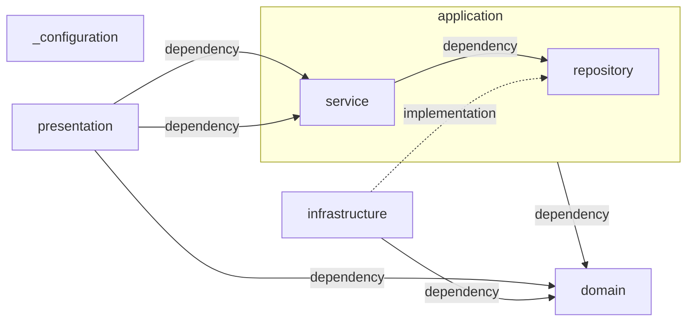

    以下の要件に沿ってTODOアプリを作成してください。

## 利用する技術スタック

### 前提条件

- kotlin multiplatform 2.1.10 以上
- Gradle 8.x 以上

### フロントエンド/バックエンド 共通

- spotless

### フロントエンド

#### フレームワーク
- compose multiplatform for web
- ktor-client

#### その他
- kotlinx.datetime
- kotlinx.serialization

### バックエンド

#### フレームワーク
- ktor-server
- koin

#### ORM

- exposed
- r2dbc

#### その他
- kotlinx.datetime
- kotlinx.serialization

### ミドルウェア

- PostgreSQL(開発/本番環境)  
  ローカルでの開発環境はdockerを利用する

## ソフトウェアアーキテクチャ

### フロントエンド

本プロジェクトのフロントエンドは、**Feature-Based Architecture（機能単位アーキテクチャ）** を採用しています。機能ごとに責務を分割し、保守性と拡張性を高める構成です。
```
src/
├── app/ # アプリケーション全体の設定（ルーティング・プロバイダなど）
├── components/ # 共通UIコンポーネント
├── features/ # 機能単位のディレクトリ群
│ ├── todo/ # 「Todo」機能に関するすべての実装
│ │ ├── components/ # Todo専用UIコンポーネント
│ │ ├── pages/ # 画面単位のコンポーネント（ページ）
│ │ ├── hooks/ # ビジネスロジックを含むカスタムフック
│ │ ├── api/ # API呼び出し（リポジトリ層）
│ │ ├── model/ # 型定義やドメインモデル
│ │ └── slice.ts # 状態管理（Redux ToolkitやZustandなど）
└── libs/ # 汎用ユーティリティ、共通ロジック
```

#### レイヤー構成と責務

- `features/*`  
  アプリケーションの機能を単位として機能ごとにディレクトリを分けます。
  各機能は自身のUI、状態管理、APIアクセス、ドメインモデルを持ち、**疎結合なモジュール**として完結します。

#### 主なサブディレクトリの責務

- **components/**  
  Feature専用のUIコンポーネント群。共通化しない限りここに留めます。

- **pages/**  
  画面レベルのコンポーネント。ルーティングに対応し、レイアウトやデータフェッチなどを担当します。

- **hooks/**  
  ビジネスロジックを内包するカスタムフック。状態や副作用の抽象化に利用します。

- **api/**  
  API呼び出しをまとめる層。RESTやGraphQLクライアントをラップし、インフラとの依存を隔離します。

- **model/**  
  ドメインモデル  
  データ構造に関する責務を担当します。

- **slice.ts（または store.ts）**  
  状態管理を行う  
  必要な場合のみ配置します。

#### `app/`

アプリケーション全体の設定（ルーティング、グローバルステート、DIコンテナ、テーマなど）を担います。

- 例：
    - `App.kt` - アプリのトップレベルコンポーネント
    - `router.kt` - ルーティング設定
    - `providers.kt` - Context/Providerのまとめ

#### `components/`

プロジェクト全体で再利用される **共通のUIコンポーネント** を配置します。

- 例：
    - ボタン、モーダル、テーブル、フォーム部品など
    - Atomic Design などを参考に構造化する場合もあります（`atoms/`, `molecules/`, `organisms/`）

#### `libs/`

機能に依存しない**ユーティリティ関数・hooks・共通ロジック**を格納します。

#### アーキテクチャのメリット

- **機能単位で管理されることで、関心の分離（Separation of Concerns）を実現**
- **スケーラブルな構成：新機能を追加しても既存機能への影響が小さい**
- **各 feature が疎結合であり、再利用性・テスト容易性が高い**

#### 状態管理（必要な場合）

- 各機能ごとに slice/store を定義し、できるだけ**ローカル状態中心の設計**を採用

#### 補足

- グローバルに共有するもの（テーマ、ルーティング、APIクライアント）は `app/` または `libs/` に集約します。
- 必要以上にコンポーネントを共通化しすぎず、「機能に閉じた再利用」を優先します（＝ドメイン重視設計）。

### バックエンド

本システムのバックエンドは、3層レイヤードアーキテクチャにドメインモデル設計を組み合わせた構成を採用しています。  
これは、責務の分離、保守性、拡張性を意識した設計方針です。

以下のMermaid図は、各レイヤー間の依存関係と実装関係を表しています：


#### 各パッケージの役割と債務

- domain  
  アプリケーションのビジネスロジックの中心を担うレイヤー  
  ドメイン駆動設計の観点から最も重要な領域です
    - model  
      ドメインモデル（エンティティや値オブジェクト）を定義する  
      実装は原則として Kotlin 標準ライブラリのみを使用し、以下のユーティリティライブラリは使用可能とします：
        - `kotlinx.datetime` – Java/Kotlin 標準日付 API の代替
        - `kotlinx.serialization` – JSON などのシリアライズ用途
        - `am.ik.yavi` – 型安全かつ柔軟なバリデーション実装のため
    - problem  
      アプリケーション実行中に発生するドメインエラー（例外）を表現するクラス群を格納  
      通常は Throwable を継承した独自例外クラス
    - policy
      特殊なビジネスルールや複雑なバリデーション要件を表現  
      ドメインモデルを簡潔に保つため、個別に切り出す
- presentation  
  ユーザーからの入力（HTTPリクエスト等）を受け取り、アプリケーションに橋渡しをする層
    - endpoint  
      具体的なエンドポイントの定義  
      Ktorなどの Web フレームワークに依存してもよい
- application  
  ユースケースに対応する処理を定義する層で、`domain`と`presentation`を橋渡しする  
  基本的には`repository`の呼び出しのみに徹し、`domain`操作は最小限に抑える
    - service  
      アプリケーションのユースケースを表現  
      複数のドメインオブジェクトの協調処理を担当
    - repository  
      ドメインモデルの永続化抽象  
      実装は `infrastructure` に委ねる
- infrastructure  
  実際の技術的処理（データベースアクセス、外部API通信など）を担当。`domain`や`application`の抽象インターフェースを実装する。
    - datasource  
      リポジトリの実装  
      データアクセス層
    - transfer  
      外部システムとのデータ送信を行う層
    - receive  
      外部システムとのデータ受信を行う層
- _configuration  
  ktor-server や DI（例：Koin）などの設定クラスを配置  
  環境依存の設定やアプリケーション全体の初期化処理を記述する
- _extensions  
  依存ライブラリの拡張関数を定義するパッケージ

#### 依存関係ルールの補足

- `domain` レイヤーは他のレイヤーに依存しません。他レイヤーから呼び出される「純粋なビジネスロジック」として保ちます。
- `presentation` は `application` と `domain` に依存しますが、`infrastructure` には依存しません。
- `infrastructure` は `domain` の抽象（例：リポジトリインターフェース）に依存し、実装を提供します。
- `application` は `domain` を利用し、業務フロー（ユースケース）を組み立てます。

## ビルド/設定手順

### フロントエンド

#### アプリケーションのビルド

TODO

#### アプリケーションの実行

TODO

### バックエンド

#### アプリケーションのビルド

TODO

#### アプリケーションの実行

TODO

## テストに関する情報

TODO

## その他開発に関する情報

### データベースについて

本システムで利用されるデータベースの情報は下記に記載する
- ローカル環境
    - データベース名: todo
    - ユーザー: brapl
    - パスワード: brapl

#### 開発指針

本システムで利用されるテーブルは全てINSERTとSELECTのみの操作を許容し、UPDATEやDELETEに相当する操作はtableを用いて表現する

### ロギング

ログには Logback を使用（設定ファイル：logback.xml）  
開発用に適切なログレベルを logback.xml に設定

### コーディングスタイル

本システムのコーディングスタイルはktlintの規約に従う
