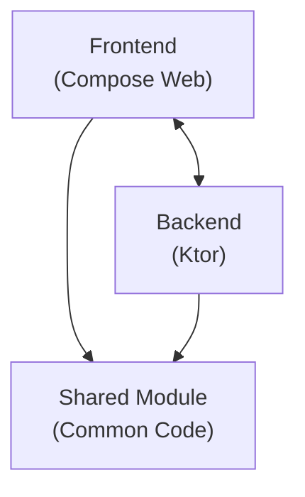
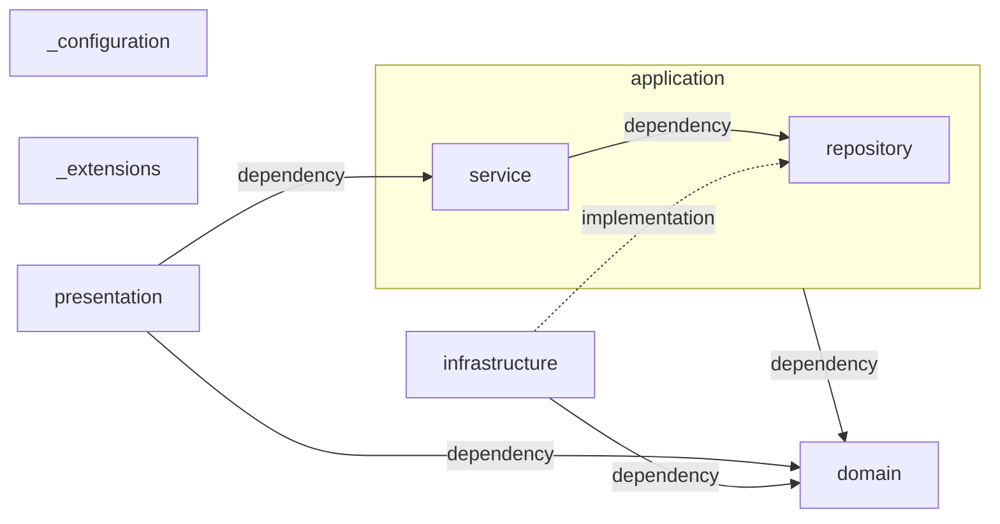

# Bright Room Todo アプリ開発ガイドライン

このドキュメントは、Bright Room Todo アプリの開発に携わる開発者向けの基本情報を提供します。

## 目次

1. [プロジェクト概要](#プロジェクト概要)
2. [アーキテクチャ](#アーキテクチャ)
3. [開発環境セットアップ](#開発環境セットアップ)
4. [プロジェクト構造](#プロジェクト構造)
5. [バックエンド開発ガイドライン](#バックエンド開発ガイドライン)
6. [フロントエンド開発ガイドライン](#フロントエンド開発ガイドライン)
7. [共有モジュール開発ガイドライン](#共有モジュール開発ガイドライン)
8. [データベース開発ガイドライン](#データベース開発ガイドライン)
9. [テスト戦略](#テスト戦略)
10. [ビルドとデプロイメント](#ビルドとデプロイメント)
11. [コード品質とベストプラクティス](#コード品質とベストプラクティス)

## プロジェクト概要

### 技術スタック

- **Kotlin Multiplatform**
- **Compose Multiplatform** (Web target: wasmJs)
- **Ktor** (サーバーサイドフレームワーク)
- **Exposed** (ORM)
- **PostgreSQL** (データベース)
- **R2DBC** (リアクティブデータベースアクセス)
- **Koin** (依存性注入)
- **Flyway** (データベースマイグレーション)
- **Docker** (コンテナ化とローカル開発環境)

### プロジェクトの特徴

- **フルスタック**: 単一のKotlinコードベースでフロントエンドとバックエンドを開発
- **リアクティブ**: R2DBCを使用した非同期データベースアクセス
- **モダンUI**: Compose Multiplatformによる宣言的UI
- **型安全**: Kotlinの型システムを活用した安全なAPI設計
- **スケーラブル**: クリーンアーキテクチャによる保守性の高い設計

## アーキテクチャ

### 全体アーキテクチャとモジュール依存関係



### プロジェクト構造

```
project-root/
├── backend/
│   ├── api/                    # Restful API
│   └── scheduler/              # バックグラウンドタスク
├── frontend/
│   └── app/                    # Compose Multiplatform for Web アプリ
├── shared/                     # Frontend, Backend共通で利用するコード
├── docker/                     # Docker設定とマイグレーション
├── gradle/                     # Gradle設定
└── build.gradle.kts           # ルートビルド設定
```

### バックエンドアーキテクチャ (3層レイヤードアーキテクチャ + ドメインモデル)

本システムのバックエンドは、3層レイヤードアーキテクチャにドメインモデル設計を組み合わせた構成を採用しています。  
これは、責務の分離、保守性、拡張性を意識した設計方針です。

以下のMermaid図は、各レイヤー間の依存関係と実装関係を表しています：


### 各パッケージの役割と債務

#### domain

アプリケーションのビジネスロジックの中心を担うレイヤーであり、ドメイン駆動設計の観点から最も重要な領域です。  
ドメインモデルに集めた業務ロジックを3層(presentation, application, infrastructure)が利用します。

**model**

業務データと関連する業務ロジックを表現したドメインオブジェクトを定義するレイヤーです。  
業務的な判断・加工・計算ロジックは全てドメインオブジェクトとして、データとロジックをひとまとめに実装します。

実装は原則として Kotlin もしくは Java の標準ライブラリのみを許容します  
ただし、以下の依存ライブラリは許容します：
- `kotlinx.datetime` – Java/Kotlin 標準日付 API の代替
- `kotlinx.serialization` – JSON などのシリアライズ用途
- `am.ik.yavi` – 型安全かつ柔軟なバリデーション実装のため

**problem**

アプリケーション実行中に発生するエラー（例外）を表現するクラス群を格納。  
通常は Throwable を継承した独自例外クラスのみとし、実装は必要最低限とします。  
(標準ライブラリや依存ライブラリ内で表現できるものは実装しない 例: バリデーションエラー→`IllegalArgumentException`)


**policy**

特殊なビジネスルールや複雑なバリデーション要件を表現。  
ドメインモデルを簡潔に保つため、バリデーションルールの実装のみを個別に切り出す。
    

#### presentation

ユーザーからの入力（HTTPリクエスト等）を受け取り、アプリケーションに橋渡しをする層。 。

**endpoint**

具体的なエンドポイントの定義。  
Ktorなどの Web フレームワークに依存してもよい。

#### application  

アプリケーションを実装するうえでの進行役で、`domain`と`presentation`を橋渡しする

**service**

アプリケーションを実装するうえでの進行役を表現。  
ドメインモデル内のビジネスロジックには立ち入らず、タスクの調整に留める。

**repository**

ドメインモデルの永続化抽象。  
実装は `infrastructure` に委ねる。

#### infrastructure  

実際の技術的処理（データベースアクセス、外部API通信など）を担当。  
`domain`や`application`の抽象インターフェースを実装する。

**datasource*

`repository`の実装で、データベースなどの具体的永続化処理等の操作を実装する。

**transfer**

外部システムとのデータ送信を行う層。

**receive**

外部システムとのデータ受信を行う層 。

#### _configuration  

ktor-server や DI（例：Koin）などの設定クラスを配置。  
環境依存の設定やアプリケーション全体の初期化処理を記述する。

#### _extensions  

依存ライブラリの拡張関数を定義するパッケージ

## 開発環境セットアップ

### 前提条件

- **JDK**: 21以上
- **Kotlin**: 2.2.0以上
- **Gradle**: 8.x以上
- **Docker**: 最新版
- **Node.js**: 22以上 (フロントエンドビルド用)

### 初期セットアップ

1. **リポジトリクローン**
```bash
git clone <repository-url>
cd <project-name>
```

1. **Docker環境起動**
```bash
docker compose -f compose.yaml up -d
```

1. **データベースマイグレーション**
```bash
docker compose -f docker/flyway.yaml up
```

1. **依存関係インストール**
```bash
./gradlew build
```

## バックエンド開発ガイドライン

### ドメイン駆動設計 (DDD)

TODO

### ドメインモデル

ドメインモデルは、業務領域の概念とルールをコードで表現するための中核的な要素です。

本アプリケーションでは、ドメインモデルを以下の2つの要素で構成します：
- **値オブジェクト**: `value class` または `enum` を使用
- **集約モデル**: `data class` を使用


#### 値オブジェクト

業務で扱うデータの種類ごとに専用の型を定義し、プリミティブ型の値に意味と制約を与えます。  
決められた値がある場合は`enum`を、それ以外は`value class`を使用します。

**`value class`の実装例:**
```kotlin
/**
 * タスクのタイトル
 */
@JvmInline
@Serializable
value class Title(private val value: String) {
    operator fun invoke(): String = value
    override fun toString(): String = value

    companion object {
        val validator = validator {
            (Title::value)("タスクタイトル") {
                notBlank().message("タスクタイトルが空文字")
                greaterThanOrEqual(1).message("タスクタイトルは1文字以上")
                lessThanOrEqual(30).message("タスクタイトルは30文字以下")
            }
        }
    }
}
```

**`enum`の実装例:**
```kotlin
/**
 * 繰り返しルール
 */
enum class RepeatRule {
    繰り返しなし,
    毎日,
    平日のみ,
    休日のみ,
    週単位,
    月単位,
    年単位;
    
    fun is繰り返しなし(): Boolean = this == 繰り返しなし
}
```

**値オブジェクトのベストプラクティス:**
- プロパティは不変（`private val`）とする
- `invoke`メソッドの実装は必須とし、値オブジェクトの値を返す
- `invoke`メソッドの利用は、値オブジェクトが持つプロパティのデータが必要な場合のみに留める
- `toString`メソッドの実装は必須とし、値オブジェクトを文字列に変換して返す
- バリデーションは`am.ik.yavi`を活用し、`companion object`に定義する
- ドメイン固有の判定メソッドを定義する（`enum`の場合）

#### 集約モデル

関連する値オブジェクトをまとめ、業務上の一貫性を保つ責任を持つオブジェクトです。  
ビジネスルールやドメインロジックを内包します。

```kotlin
@Serializable
data class Task(
    val id: TaskId,
    val title: Title,
    val description: Description = Description(""),
    val dueDate: DueDate,
) {
    /**
     * 期日までの日数を計算する
     */
    fun toDaysUntilDue(): DaysUntilDue {
        val today = Clock.System.now().toLocalDateTime(TimeZone.currentSystemDefault()).date
        val dueDateValue = dueDate.toLocalDate()
        return DaysUntilDue(dueDateValue.toEpochDays() - today.toEpochDays())
    }

    /**
     * タスクが期限切れかどうかを判定する
     */
    fun isOverdue(): Boolean = toDaysUntilDue().invoke() < 0

    companion object {
        val validator = validator {
            // 集約全体のバリデーションルールを定義
        }
    }
}

@Serializable
data class Tasks(val list: List<Task>) {
    /**
     * 期限切れのタスクを取得する
     */
    fun getOverdueTasks(): Tasks = Tasks(list.filter { it.isOverdue() })

    /**
     * タスクの総数を取得する
     */
    fun count(): Int = list.size
}
```

**集約モデルのベストプラクティス:**
- 不変オブジェクト（`data class`）を使用する
- ビジネスルールとドメインロジックを集約モデル内に実装する
- 値オブジェクトを積極的に活用し、プリミティブ型の直接使用を避ける
- バリデーションは`am.ik.yavi`を活用し、`companion object`に定義する
- メソッド名は業務の言葉を使用し、ドメインエキスパートが理解しやすくする
- 集約の境界を明確にし、他の集約への直接的な参照は避ける

#### 設計指針
1. **ユビキタス言語の活用**: ドメインエキスパートと開発者が共通して使用する言葉をクラス名やメソッド名に反映する
2. **不変性の重視**: 予期しない状態変更を防ぎ、スレッドセーフティを確保する
3. **表現力の向上**: プリミティブ型ではなく、業務の概念を表す専用の型を使用する
4. **バリデーションの集約**: ビジネスルールに基づく検証ロジックを適切な場所に配置する

### アプリケーション層

アプリケーション層は、プレゼンテーション層とドメイン層の橋渡しを行い、ユースケースの実行を担当します。  
ビジネスロジックはドメイン層に委譲し、アプリケーション層では処理のオーケストレーションに専念します。

#### アプリケーションサービス

各ユースケースに対応するサービスクラスを定義し、ドメインオブジェクトとリポジトリを使用してビジネス処理を実行します。

**実装例:**

```kotlin
/**
 * タスク参照サービス
 */
class TaskQueryService(
    private val taskRepository: TaskRepository
) {
    /**
     * 指定されたIDのタスクを取得する
     */
    suspend fun find(taskId: TaskId): Task {
        return taskRepository.find(taskId)
    }

    /**
     * 全てのタスクを取得する
     */
    suspend fun listAll(): Tasks {
        return taskRepository.listAll()
    }
    
    /**
     * 期限切れのタスクを取得する
     */
    suspend fun getOverdueTasks(): Tasks {
        val allTasks = taskRepository.listAll()
        return allTasks.getOverdueTasks()
    }
}

/**
 * タスク作成サービス
 */
class TaskCreateService(
    private val taskCreateRepository: TaskCreateRepository
) {
    /**
     * 新しいタスクを作成する
     */
    suspend fun create(request: TaskCreateRequest): Task {
        // バリデーションの実行
        Title.validator.validate(Title(request.title)).throwIfInvalid()
        Description.validator.validate(Description(request.description)).throwIfInvalid()
        
        // ドメインオブジェクトの生成
        val task = Task(
            id = TaskId.generate(),
            title = Title(request.title),
            description = Description(request.description),
            dueDate = DueDate(request.dueDate)
        )
        
        // リポジトリを通じた永続化
        return taskCreateRepository.create(task)
    }
}

/**
 * タスク完了サービス
 */
class TaskCompleteService(
    private val taskCompleteRepository: TaskCompleteRepository,
    private val taskRepository: TaskRepository
) {
    /**
     * タスクを完了状態にする
     */
    suspend fun complete(taskId: TaskId) {
        // 存在チェック
        taskRepository.find(taskId) // 存在しない場合は例外がスローされる
        
        // 完了処理
        taskCompleteRepository.complete(taskId)
    }
}
```

**アプリケーションサービスのベストプラクティス:**
- **単一責任の原則**: 1つのサービスクラスは1つのユースケースに対応する
- **suspend関数の使用**: 非同期処理を活用してパフォーマンスを向上させる
- **ドメインロジックの委譲**: ビジネスルールはドメインオブジェクトに委譲し、サービスは処理の調整に専念する
- **明確なメソッド名**: メソッド名はユースケースを表現し、何をするかが明確に分かるようにする
- **適切な例外処理**: ビジネス上の例外とシステム例外を適切に区別して処理する
- **バリデーションの実行**: 入力データのバリデーションを適切なタイミングで実行する


#### リポジトリパターン
データアクセスの抽象化を行い、ドメインモデルとデータ永続化の詳細を分離します。インターフェースとして定義し、実装はインフラストラクチャ層で行います。

```kotlin
/**
 * タスク参照リポジトリ
 */
interface TaskRepository {
    /**
     * 指定されたIDのタスクを取得する
     * @param taskId タスクID
     * @return タスクオブジェクト
     * @throws TaskNotFoundException タスクが見つからない場合
     */
    suspend fun find(taskId: TaskId): Task

    /**
     * 全てのタスクを取得する
     * @return タスク一覧
     */
    suspend fun listAll(): Tasks

    /**
     * 指定された条件でタスクを検索する
     * @param criteria 検索条件
     * @return 条件に一致するタスク一覧
     */
    suspend fun findBy(criteria: TaskSearchCriteria): Tasks
}

/**
 * タスク作成リポジトリ
 */
interface TaskCreateRepository {
    /**
     * タスクを作成する
     * @param task 作成するタスク
     * @return 作成されたタスク（IDが設定済み）
     */
    suspend fun create(task: Task): Task
}

/**
 * タスク更新リポジトリ
 */
interface TaskUpdateRepository {
    /**
     * タスクを更新する
     * @param task 更新するタスク
     * @return 更新されたタスク
     */
    suspend fun update(task: Task): Task
}

/**
 * タスク完了リポジトリ
 */
interface TaskCompleteRepository {
    /**
     * タスクを完了状態にする
     * @param taskId 完了するタスクのID
     */
    suspend fun complete(taskId: TaskId)
}

/**
 * タスク削除リポジトリ
 */
interface TaskDeleteRepository {
    /**
     * タスクを削除する
     * @param taskId 削除するタスクのID
     */
    suspend fun delete(taskId: TaskId)
}
```

**リポジトリパターンのベストプラクティス:**
- **操作別インターフェース分離**: CRUD操作ごとにインターフェースを分離し、必要な操作のみを公開する
- **ドメイン言語の使用**: メソッド名や引数名にドメインの言葉を使用する
- **suspend関数の使用**: 非同期処理に対応する
- **適切な戻り値**: ドメインオブジェクトを返し、データアクセス層の詳細を隠蔽する
- **明確なドキュメント**: メソッドの動作と例外について明確に記述する
- **検索条件の抽象化**: 複雑な検索条件は専用のクライテリアオブジェクトを使用する

#### 設計指針
1. **薄いアプリケーション層**: ビジネスロジックはドメイン層に委譲し、アプリケーション層は薄く保つ
2. **ユースケース中心設計**: 各サービスクラスは明確なユースケースに対応する
3. **依存関係の方向**: アプリケーション層はドメイン層に依存するが、逆はない
4. **トランザクション境界**: 必要に応じてトランザクション境界をアプリケーションサービスで定義する
5. **エラーハンドリング**: ドメイン例外とインフラ例外を適切に処理し、上位層に適切な情報を返す

### インフラストラクチャ層

インフラストラクチャ層は、実際の技術的処理（データベースアクセス、外部API通信、ファイルI/Oなど）を担当します。  
ドメイン層やアプリケーション層で定義された抽象インターフェースの具体的な実装を提供し、外部システムとの結合点となります。

#### データソース層（datasource）

リポジトリインターフェースの具体実装を行い、データベースなどへの永続化処理を担当します。  
本プロジェクトではExposed DSLを使用してデータアクセスを行います。

**命名規則:**
- クラス名のサフィックスは`DataSource`を使用する

**実装例:**
```kotlin
/**
 * タスクデータソース実装
 */
@Repository
class TaskDataSource : TaskRepository {
    
    override suspend fun find(taskId: TaskId): Task = newSuspendedTransaction {
        TaskTable
            .select { TaskTable.id eq taskId.invoke() }
            .singleOrNull()
            ?.let { it.toTask() }
            ?: throw TaskNotFoundException("Task not found: ${taskId.invoke()}")
    }
    
    override suspend fun listAll(): Tasks = newSuspendedTransaction {
        val tasks = TaskTable
            .selectAll()
            .map { it.toTask() }
        Tasks(tasks)
    }
    
    override suspend fun findBy(criteria: TaskSearchCriteria): Tasks = newSuspendedTransaction {
        var query = TaskTable.selectAll()
        
        criteria.title?.let { title ->
            query = query.andWhere { TaskTable.title like "%$title%" }
        }
        criteria.dueDateFrom?.let { dateFrom ->
            query = query.andWhere { TaskTable.dueDate greaterEq dateFrom }
        }
        criteria.dueDateTo?.let { dateTo ->
            query = query.andWhere { TaskTable.dueDate lessEq dateTo }
        }
        criteria.isCompleted?.let { completed ->
            query = query.andWhere { TaskTable.isCompleted eq completed }
        }
        
        val tasks = query.map { it.toTask() }
        Tasks(tasks)
    }
}

/**
 * タスク作成データソース実装
 */
@Repository
class TaskCreateDataSource : TaskCreateRepository {
    
    override suspend fun create(task: Task): Task = newSuspendedTransaction {
        val taskId = TaskTable.insertAndGetId {
            it[id] = task.id.invoke()
            it[title] = task.title.invoke()
            it[description] = task.description.invoke()
            it[dueDate] = task.dueDate.toLocalDate()
            it[isCompleted] = false
            it[createdAt] = Clock.System.now().toLocalDateTime(TimeZone.UTC)
            it[updatedAt] = Clock.System.now().toLocalDateTime(TimeZone.UTC)
        }
        
        task.copy(id = TaskId(taskId.value))
    }
}

/**
 * タスク完了データソース実装
 */
@Repository
class TaskCompleteDataSource : TaskCompleteRepository {
    
    override suspend fun complete(taskId: TaskId) = newSuspendedTransaction {
        val updatedCount = TaskTable.update({ TaskTable.id eq taskId.invoke() }) {
            it[isCompleted] = true
            it[updatedAt] = Clock.System.now().toLocalDateTime(TimeZone.UTC)
        }
        
        if (updatedCount == 0) {
            throw TaskNotFoundException("Task not found for completion: ${taskId.invoke()}")
        }
    }
}
```

**SQLオブジェクトクラス（隔離されたSQL定義）:**
```kotlin
/**
 * タスクテーブル定義
 */
object TaskTable : Table("tasks") {
    val id = varchar("id", 36).primaryKey()
    val title = varchar("title", 100)
    val description = text("description")
    val dueDate = date("due_date")
    val isCompleted = bool("is_completed").default(false)
    val createdAt = datetime("created_at")
    val updatedAt = datetime("updated_at")
}

/**
 * ResultRowをドメインオブジェクトに変換する拡張関数
 */
fun ResultRow.toTask(): Task = Task(
    id = TaskId(this[TaskTable.id]),
    title = Title(this[TaskTable.title]),
    description = Description(this[TaskTable.description]),
    dueDate = DueDate(this[TaskTable.dueDate])
)
```

**データソース層のベストプラクティス:**
- **1インターフェース1実装**: 各リポジトリインターフェースに対して1つの実装クラスを提供する
- **トランザクション境界**: `suspendedTransaction`を使用してトランザクション境界を明確にする
- **例外の適切な処理**: データアクセスエラーをドメイン例外に変換する
- **SQL定義の隔離**: SQLクエリやテーブル定義を専用のオブジェクトクラスに分離する
- **型安全性**: Exposed DSLの型安全な機能を活用する

#### 転送層（transfer）

外部システムへのデータ送信を担当します。  
API呼び出し、ファイル出力、メッセージ送信などを行います。

**命名規則:**
- クラス名のサフィックスは`Transfer`を使用する
- 転送対象を明確にする（例：`FileTransfer`、`ApiTransfer`、`MessageTransfer`）

**実装例:**
```kotlin
/**
 * 通知API転送サービス
 */
@Service
class NotificationApiTransfer(
    private val httpClient: HttpClient,
    private val notificationConfig: NotificationConfig
) : NotificationService {

    override suspend fun sendTaskDeadlineNotification(task: Task) {
        val request = TaskDeadlineNotificationRequest(
            taskId = task.id.invoke(),
            title = task.title.invoke(),
            dueDate = task.dueDate.toLocalDate().toString(),
            daysUntilDue = task.toDaysUntilDue().invoke()
        )
        
        try {
            val response = httpClient.post(notificationConfig.endpoint) {
                contentType(ContentType.Application.Json)
                setBody(request)
                headers {
                    append("Authorization", "Bearer ${notificationConfig.apiKey}")
                }
                timeout {
                    requestTimeoutMillis = notificationConfig.timeout.toMillis()
                }
            }
            
            if (!response.status.isSuccess()) {
                throw NotificationTransferException("API送信に失敗しました: ${response.status}")
            }
        } catch (e: Exception) {
            throw NotificationTransferException("通知API転送エラー", e)
        }
    }
}

/**
 * ファイル転送サービス
 */
@Service
class TaskReportFileTransfer(
    private val fileConfig: FileConfig
) : TaskReportService {

    override suspend fun exportTaskReport(tasks: Tasks, format: ReportFormat): String {
        val reportData = when (format) {
            ReportFormat.CSV -> generateCsvReport(tasks)
            ReportFormat.JSON -> generateJsonReport(tasks)
        }
        
        val filename = "task_report_${Clock.System.now().toEpochMilliseconds()}.${format.extension}"
        val filepath = "${fileConfig.exportPath}/$filename"
        
        try {
            File(filepath).writeText(reportData, Charsets.UTF_8)
            return filepath
        } catch (e: Exception) {
            throw FileTransferException("レポートファイルの出力に失敗しました", e)
        }
    }
    
    private fun generateCsvReport(tasks: Tasks): String {
        val header = "ID,Title,Description,DueDate,IsOverdue"
        val rows = tasks.list.joinToString("\n") { task ->
            "${task.id.invoke()},\"${task.title.invoke()}\",\"${task.description.invoke()}\",${task.dueDate.toLocalDate()},${task.isOverdue()}"
        }
        return "$header\n$rows"
    }
    
    private fun generateJsonReport(tasks: Tasks): String {
        return Json.encodeToString(tasks)
    }
}

/**
 * メッセージキュー転送サービス
 */
@Service
class TaskEventMessageTransfer(
    private val messageProducer: MessageProducer,
    private val messageConfig: MessageConfig
) : TaskEventPublisher {

    override suspend fun publishTaskCreated(task: Task) {
        val event = TaskCreatedEvent(
            taskId = task.id.invoke(),
            title = task.title.invoke(),
            createdAt = Clock.System.now().toString()
        )
        
        try {
            messageProducer.send(
                topic = messageConfig.taskEventTopic,
                message = Json.encodeToString(event)
            )
        } catch (e: Exception) {
            throw MessageTransferException("タスク作成イベントの送信に失敗しました", e)
        }
    }
}
```

**転送層のベストプラクティス:**
- **リトライ機能**: 外部システムへの通信失敗に対する適切なリトライ戦略を実装する
- **タイムアウト設定**: 適切なタイムアウト値を設定し、システムの応答性を保つ
- **エラーハンドリング**: 外部システムのエラーを適切にキャッチし、ドメイン例外に変換する
- **ログ出力**: 外部システムとの通信状況を適切にログに記録する
- **設定の外部化**: エンドポイントやAPIキーなどの設定値を外部設定ファイルで管理する

#### 受信層（receive）

外部システムからのデータ受信を担当します。  
Webhook、メッセージ受信、ファイル監視などを行います。

**命名規則:**
- クラス名のサフィックスは`Receive`を使用する
- 受信対象を明確にする（例：`FileReceive`、`WebhookReceive`、`MessageReceive`）

**実装例:**
```kotlin
/**
 * タスクWebhook受信処理
 */
@RestController
@RequestMapping("/webhook")
class TaskWebhookReceive(
    private val taskUpdateService: TaskUpdateService,
    private val webhookValidator: WebhookValidator
) {

    @PostMapping("/task-status-update")
    suspend fun receiveTaskStatusUpdate(
        @RequestBody request: TaskStatusUpdateWebhookRequest,
        @RequestHeader("X-Webhook-Signature") signature: String
    ): ResponseEntity<WebhookResponse> {
        
        return try {
            // Webhook署名検証
            webhookValidator.validateSignature(request, signature)
            
            // ドメインオブジェクトに変換
            val taskId = TaskId(request.taskId)
            val status = TaskStatus.valueOf(request.status)
            
            // アプリケーションサービス呼び出し
            taskUpdateService.updateStatus(taskId, status)
            
            ResponseEntity.ok(WebhookResponse("success"))
        } catch (e: WebhookValidationException) {
            ResponseEntity.badRequest().body(WebhookResponse("Invalid signature"))
        } catch (e: Exception) {
            ResponseEntity.internalServerError().body(WebhookResponse("Internal error"))
        }
    }
}

/**
 * タスクファイル受信処理
 */
@Component
class TaskFileReceive(
    private val taskImportService: TaskImportService,
    private val fileConfig: FileConfig
) {

    @Scheduled(fixedDelay = 30000) // 30秒間隔
    suspend fun receiveTaskImportFiles() {
        val importDir = File(fileConfig.importPath)
        val files = importDir.listFiles { file -> 
            file.extension.lowercase() in listOf("csv", "json") && !file.name.startsWith(".")
        }
        
        files?.forEach { file ->
            try {
                processImportFile(file)
                // 処理済みファイルを別ディレクトリに移動
                moveToProcessedDirectory(file)
            } catch (e: Exception) {
                // エラーファイルを別ディレクトリに移動
                moveToErrorDirectory(file, e)
            }
        }
    }
    
    private suspend fun processImportFile(file: File) {
        when (file.extension.lowercase()) {
            "csv" -> processCsvFile(file)
            "json" -> processJsonFile(file)
        }
    }
    
    private fun moveToProcessedDirectory(file: File) {
        val timestamp = Clock.System.now().toEpochMilliseconds()
        val newFile = File("${fileConfig.processedPath}/${timestamp}_${file.name}")
        file.renameTo(newFile)
    }
    
    private fun moveToErrorDirectory(file: File, error: Exception) {
        val timestamp = Clock.System.now().toEpochMilliseconds()
        val errorFile = File("${fileConfig.errorPath}/${timestamp}_${file.name}")
        file.renameTo(errorFile)
    }
}

/**
 * タスクメッセージ受信処理
 */
@Component
class TaskMessageReceive(
    private val taskCreateService: TaskCreateService,
    private val messageValidator: MessageValidator
) {

    @EventListener
    suspend fun receiveTaskCreateMessage(message: TaskCreateMessage) {
        try {
            // メッセージバリデーション
            messageValidator.validate(message)
            
            // ドメインオブジェクトに変換
            val request = TaskCreateRequest(
                title = message.title,
                description = message.description,
                dueDate = LocalDate.parse(message.dueDate)
            )
            
            // タスク作成処理
            taskCreateService.create(request)
            
        } catch (e: Exception) {
            // エラーハンドリング
            handleMessageProcessingError(message, e)
        }
    }
    
    private suspend fun handleMessageProcessingError(message: TaskCreateMessage, error: Exception) {
        // エラーログ出力とデッドレターキュー送信
        logger.error("タスク作成メッセージの処理に失敗しました", error)
    }
}
```

**受信層のベストプラクティス:**
- **冪等性の確保**: 同じデータを複数回受信しても問題ないよう冪等性を保つ
- **バリデーション**: 受信データの妥当性を適切に検証する
- **エラーハンドリング**: 受信エラーに対する適切な処理（リトライ、デッドレター等）を実装する
- **セキュリティ**: Webhook署名検証など、適切なセキュリティ対策を実装する
- **モニタリング**: 受信状況を監視し、異常を検知できる仕組みを構築する

## プレゼンテーション層

プレゼンテーション層は、ユーザーからの入力（HTTPリクエスト等）を受け取り、アプリケーション層に橋渡しをする層です。外部からのアクセスポイントとして機能し、リクエストの受信、バリデーション、レスポンスの生成を担当します。

### エンドポイント層（endpoint）

具体的なエンドポイントの定義を行います。KtorなどのWebフレームワークに依存することを許可し、HTTPリクエストの処理を担当します。

**設計原則:**
- **URIは目的ごとに定義**: パスパラメータは使用せず、明確な目的を持つURIを定義する
- **HTTPメソッドはGETまたはPOSTのみ**: シンプルなHTTPメソッドの利用に限定する
- **クエリパラメータの型安全な扱い**: Resourceプラグインを使用して型安全にクエリパラメータを処理する
- **JSONパース**: kotlinx serializationを使用してJSONの変換を行う
- **バリデーション**: プレゼンテーション層でリクエストデータのバリデーションを実行する

**実装例:**

```kotlin
/**
 * タスク参照エンドポイント
 */
fun Application.configureTaskQueryRouting() {
    routing {
        val taskQueryService by inject<TaskQueryService>()
        
        /**
         * 全タスク取得
         * GET /tasks
         */
        get<TaskListResource> { resource ->
            try {
                val tasks = taskQueryService.listAll()
                val response = tasks.list.map { it.toResponse() }
                call.respond(HttpStatusCode.OK, TaskListResponse(response))
            } catch (e: Exception) {
                call.respond(
                    HttpStatusCode.InternalServerError, 
                    ErrorResponse("タスクの取得に失敗しました")
                )
            }
        }
        
        /**
         * タスク検索
         * GET /tasks/search?title=xxx&dueDateFrom=yyyy-mm-dd&dueDateTo=yyyy-mm-dd&isCompleted=true
         */
        get<TaskSearchResource> { resource ->
            try {
                // クエリパラメータのバリデーション
                validateTaskSearchParams(resource)
                
                val criteria = TaskSearchCriteria(
                    title = resource.title,
                    dueDateFrom = resource.dueDateFrom?.let { LocalDate.parse(it) },
                    dueDateTo = resource.dueDateTo?.let { LocalDate.parse(it) },
                    isCompleted = resource.isCompleted
                )
                
                val tasks = taskQueryService.findBy(criteria)
                val response = tasks.list.map { it.toResponse() }
                call.respond(HttpStatusCode.OK, TaskListResponse(response))
                
            } catch (e: ValidationException) {
                call.respond(HttpStatusCode.BadRequest, ErrorResponse(e.message ?: "バリデーションエラー"))
            } catch (e: Exception) {
                call.respond(
                    HttpStatusCode.InternalServerError, 
                    ErrorResponse("タスクの検索に失敗しました")
                )
            }
        }
        
        /**
         * 指定タスク取得
         * GET /tasks/detail?id=task-id
         */
        get<TaskDetailResource> { resource ->
            try {
                // IDのバリデーション
                if (resource.id.isBlank()) {
                    call.respond(HttpStatusCode.BadRequest, ErrorResponse("タスクIDが必要です"))
                    return@get
                }
                
                val taskId = TaskId(resource.id)
                val task = taskQueryService.find(taskId)
                call.respond(HttpStatusCode.OK, task.toResponse())
                
            } catch (e: TaskNotFoundException) {
                call.respond(HttpStatusCode.NotFound, ErrorResponse("タスクが見つかりません"))
            } catch (e: Exception) {
                call.respond(
                    HttpStatusCode.InternalServerError, 
                    ErrorResponse("タスクの取得に失敗しました")
                )
            }
        }
    }
}

/**
 * タスク操作エンドポイント
 */
fun Application.configureTaskOperationRouting() {
    routing {
        val taskCreateService by inject<TaskCreateService>()
        val taskCompleteService by inject<TaskCompleteService>()
        
        /**
         * タスク作成
         * POST /tasks/create
         */
        post<TaskCreateResource> {
            try {
                val request = call.receive<TaskCreateRequest>()
                
                // リクエストバリデーション
                validateTaskCreateRequest(request)
                
                val createdTask = taskCreateService.create(request)
                call.respond(HttpStatusCode.Created, createdTask.toResponse())
                
            } catch (e: ValidationException) {
                call.respond(HttpStatusCode.BadRequest, ErrorResponse(e.message ?: "バリデーションエラー"))
            } catch (e: Exception) {
                call.respond(
                    HttpStatusCode.InternalServerError, 
                    ErrorResponse("タスクの作成に失敗しました")
                )
            }
        }
        
        /**
         * タスク完了
         * POST /tasks/complete
         */
        post<TaskCompleteResource> {
            try {
                val request = call.receive<TaskCompleteRequest>()
                
                // リクエストバリデーション
                if (request.taskId.isBlank()) {
                    call.respond(HttpStatusCode.BadRequest, ErrorResponse("タスクIDが必要です"))
                    return@post
                }
                
                val taskId = TaskId(request.taskId)
                taskCompleteService.complete(taskId)
                call.respond(HttpStatusCode.OK, SuccessResponse("タスクを完了しました"))
                
            } catch (e: TaskNotFoundException) {
                call.respond(HttpStatusCode.NotFound, ErrorResponse("タスクが見つかりません"))
            } catch (e: Exception) {
                call.respond(
                    HttpStatusCode.InternalServerError, 
                    ErrorResponse("タスクの完了処理に失敗しました")
                )
            }
        }
    }
}
```

**リソース定義（型安全なクエリパラメータ）:**

```kotlin
/**
 * タスク一覧取得リソース
 */
@Serializable
@Resource("/tasks")
class TaskListResource

/**
 * タスク検索リソース
 */
@Serializable
@Resource("/tasks/search")
data class TaskSearchResource(
    val title: String? = null,
    val dueDateFrom: String? = null,
    val dueDateTo: String? = null,
    val isCompleted: Boolean? = null
)

/**
 * タスク詳細取得リソース
 */
@Serializable
@Resource("/tasks/detail")
data class TaskDetailResource(
    val id: String
)

/**
 * タスク作成リソース
 */
@Serializable
@Resource("/tasks/create")
class TaskCreateResource

/**
 * タスク完了リソース
 */
@Serializable
@Resource("/tasks/complete")
class TaskCompleteResource
```

**プレゼンテーション層のベストプラクティス:**

1. **責任の明確化**
    - リクエストの受信とレスポンスの生成に専念する
    - ビジネスロジックはアプリケーション層に委譲する

2. **バリデーションの実装**
    - プレゼンテーション層でリクエストデータのバリデーションを行う
    - 詳細なエラーメッセージを提供する

3. **型安全性の確保**
    - Resourceプラグインを使用してクエリパラメータを型安全に扱う
    - kotlinx serializationでJSONの変換を行う

4. **エラーハンドリング**
    - 適切なHTTPステータスコードを返す
    - ユーザーフレンドリーなエラーメッセージを提供する

5. **RESTful設計の簡素化**
    - HTTPメソッドはGETとPOSTのみを使用する
    - URIは目的ごとに明確に定義する

6. **ドキュメンテーション**
    - エンドポイントの目的と使用方法を明確にコメントする
    - リクエスト・レスポンスの形式を明確に定義する

### 設定とセットアップ

```kotlin
/**
 * Ktorアプリケーションの設定
 */
fun Application.configureRouting() {
    install(ContentNegotiation) {
        json(Json {
            prettyPrint = true
            isLenient = true
            ignoreUnknownKeys = true
        })
    }
    
    install(Resources)
    
    install(StatusPages) {
        exception<ValidationException> { call, cause ->
            call.respond(HttpStatusCode.BadRequest, ErrorResponse(cause.message ?: "バリデーションエラー"))
        }
        
        exception<TaskNotFoundException> { call, cause ->
            call.respond(HttpStatusCode.NotFound, ErrorResponse(cause.message ?: "リソースが見つかりません"))
        }
        
        exception<Throwable> { call, cause ->
            call.respond(
                HttpStatusCode.InternalServerError, 
                ErrorResponse("内部サーバーエラーが発生しました")
            )
        }
    }
    
    // ルーティング設定
    configureTaskQueryRouting()
    configureTaskOperationRouting()
}
```

#### 設計指針

1. **薄いプレゼンテーション層**: HTTPリクエスト/レスポンスの処理のみに専念し、ビジネスロジックは含まない
2. **入力検証**: すべての外部入力に対して適切なバリデーションを実施する
3. **エラー処理の統一**: 統一されたエラーレスポンス形式を使用する
4. **型安全性**: コンパイル時に型エラーを検出できる設計にする
5. **テスタビリティ**: 単体テストが書きやすい構造にする
6. **設定の分離**: フレームワーク固有の設定を適切に分離する

### データベース設計

#### Exposed設定

```kotlin
object Tasks : Table("tasks") {
    val id = uuid("id").default(UUID.randomUUID())
    val title = varchar("title", 200)
    val description = text("description").default("")
    val dueDate = date("due_date")
    val createdAt = timestamp("created_at").default(Clock.System.now())

    override val primaryKey = PrimaryKey(id)
}
```

## フロントエンド開発ガイドライン

### Compose Multiplatform for Web

#### アプリケーション構造

```kotlin
@Composable
fun App() {
    MaterialTheme {
        var tasks by remember { mutableStateOf(emptyList<Task>()) }

        LaunchedEffect(Unit) {
            tasks = taskRepository.getAllTasks()
        }

        TaskListScreen(
            tasks = tasks,
            onTaskCreate = { task ->
                tasks = tasks + task
            }
        )
    }
}
```

#### 状態管理

```kotlin
@Composable
fun TaskListScreen(
    tasks: List<Task>,
    onTaskCreate: (Task) -> Unit
) {
    var showCreateDialog by remember { mutableStateOf(false) }

    Column {
        Button(
            onClick = { showCreateDialog = true }
        ) {
            Text("新しいタスクを作成")
        }

        LazyColumn {
            items(tasks) { task ->
                TaskItem(task = task)
            }
        }
    }

    if (showCreateDialog) {
        CreateTaskDialog(
            onDismiss = { showCreateDialog = false },
            onConfirm = { task ->
                onTaskCreate(task)
                showCreateDialog = false
            }
        )
    }
}
```

#### HTTP通信

```kotlin
class TaskRepository {
    private val client = HttpClient {
        install(ContentNegotiation) {
            json()
        }
    }

    suspend fun getAllTasks(): List<Task> {
        return client.get("http://localhost:8080/api/v1/tasks").body()
    }

    suspend fun createTask(request: CreateTaskRequest): Task {
        return client.post("http://localhost:8080/api/v1/tasks") {
            contentType(ContentType.Application.Json)
            setBody(request)
        }.body()
    }
}
```

### UI/UXガイドライン

#### Material Design 3

- **カラーシステム**: Material You対応
- **タイポグラフィ**: 階層的な文字スタイル
- **コンポーネント**: 一貫性のあるUI要素

#### レスポンシブデザイン

```kotlin
@Composable
fun ResponsiveLayout(
    content: @Composable (WindowSizeClass) -> Unit
) {
    val windowSize = calculateWindowSizeClass()

    when (windowSize.widthSizeClass) {
        WindowWidthSizeClass.Compact -> {
            // モバイル向けレイアウト
        }
        WindowWidthSizeClass.Medium -> {
            // タブレット向けレイアウト
        }
        WindowWidthSizeClass.Expanded -> {
            // デスクトップ向けレイアウト
        }
    }
}
```

## 共有モジュール開発ガイドライン

### 共通データ型

```kotlin
// shared/src/commonMain/kotlin
@Serializable
data class TaskDto(
    val id: String,
    val title: String,
    val description: String,
    val dueDate: String?,
    val isCompleted: Boolean
)

object ApiEndpoints {
    const val BASE_URL = "http://localhost:8080"
    const val TASKS = "/api/v1/tasks"
}
```

### プラットフォーム固有実装

```kotlin
// shared/src/commonMain/kotlin
expect fun getPlatform(): Platform

interface Platform {
    val name: String
}

// shared/src/jvmMain/kotlin
actual fun getPlatform(): Platform = JvmPlatform()

private class JvmPlatform : Platform {
    override val name: String = "JVM ${System.getProperty("java.version")}"
}

// shared/src/wasmJsMain/kotlin
actual fun getPlatform(): Platform = WasmJsPlatform()

private class WasmJsPlatform : Platform {
    override val name: String = "Wasm JS"
}
```

## データベース開発ガイドライン

### マイグレーション管理

#### DDLの定義

#### コーディングガイドライン

- テーブル名は目的に沿った名前を付けること
- カラム名は目的に沿った名前を付けること
- テーブル・カラムにはコメントで和名の名前を付けること

#### テーブル設計の指針

テーブル設計にあたり、以下の制限事項を設けます。

- テーブルの操作はINSERTとSELECTに限定します。
- UPDATEに相当する操作はINSERTタスクの内容を常にINSERTし、常に最新のデータをSELECTで取得することで表現することとします。
- DELETEに相当する操作はタスクを構成する一意のキーを無効化するテーブルを用いて表現することとします。(論理削除フラグ持つ行為やブル地削除は禁止)
- テーブル内でdatetimeやtimesstampを利用する場合、1カラムのみ許容します。
- テーブル内のカラムは全て`not null`とし、必ず全てのカラムに値が入ることを想定しています。これはテーブルが目的別に沿って正しく表現をされていること期待している為です。


```sql
-- V1_1__init.sql
-- スキーマ管理
drop schema if exists todo_app cascade;
create schema todo_app;
set search_path to todo_app;

-- 繰り返しルール列挙型
create type repeat_rule_type as enum (
    '繰り返しなし',
    '毎日',
    '平日のみ',
    '休日のみ',
    '週単位',
    '月単位',
    '年単位'
    );

-- タスクテーブル
create table tasks (
    id uuid primary key default gen_random_uuid(),
    title varchar(200) not null, -- タスクタイトル
    description text not null default '', -- タスク説明
    created_at timestamp not null default current_timestamp -- 作成日時
);

-- インデックス作成
create index idx_tasks_created_at on tasks(created_at);

comment on table tasks is 'タスク';
comment on column tasks.id is 'タスクID';
comment on column tasks.title is 'タスクタイトル';
comment on column tasks.description is 'タスク説明';
comment on column tasks.created_at is '作成日時';

-- タスク繰り返しルールテーブル
create table task_repeat_rules (
    id uuid primary key default gen_random_uuid(),
    task_id uuid not null references tasks(id), -- タスクID
    repeat_type repeat_rule_type not null, -- 繰り返しタイプ
    created_at timestamp not null default current_timestamp -- 作成日時
);

-- インデックス作成
create index idx_task_repeat_rules_task_id on task_repeat_rules(task_id);

comment on table task_repeat_rules is 'タスク繰り返しルール';
comment on column task_repeat_rules.id is 'タスク繰り返しルールID';
comment on column task_repeat_rules.task_id is 'タスクID';
comment on column task_repeat_rules.repeat_type is '繰り返しタイプ';
comment on column task_repeat_rules.created_at is '作成日時';
```

#### マイグレーション実行

```bash
# 開発環境
docker compose -f docker/flyway.yaml up

# 本番環境
flyway -configFiles=flyway.conf migrate
```

### データベース接続

```kotlin
fun Application.configureDatabases() {
    val connectionFactory = ConnectionFactories.get(
        ConnectionFactoryOptions.builder()
            .option(DRIVER, "postgresql")
            .option(HOST, "localhost")
            .option(PORT, 5432)
            .option(USER, "postgres")
            .option(PASSWORD, "password")
            .option(DATABASE, "todo_app")
            .build()
    )

    Database.connect(
        R2dbcConnectionPool.create(connectionFactory)
    )
}
```

## テスト戦略

### テストピラミッド

```
        ┌─────────────┐
        │     E2E     │  ← 少数
        ├─────────────┤
        │ Integration │  ← 中程度
        ├─────────────┤
        │    Unit     │  ← 多数
        └─────────────┘
```

### ユニットテスト

```kotlin
class TaskServiceTest {
    private val taskRepository = mockk<TaskRepository>()
    private val taskService = TaskService(taskRepository)

    @Test
    fun `should create task successfully`() = runTest {
        // Given
        val title = "Test Task"
        val description = "Test Description"
        val expectedTask = Task(
            id = TaskId.generate(),
            title = title,
            description = description,
            createdAt = Clock.System.now()
        )

        coEvery { taskRepository.save(any()) } returns expectedTask

        // When
        val result = taskService.createTask(title, description)

        // Then
        assertEquals(expectedTask.title, result.title)
        assertEquals(expectedTask.description, result.description)
        coVerify { taskRepository.save(any()) }
    }
}
```

### 統合テスト

```kotlin
class TaskApiTest {
    @Test
    fun `should return all tasks`() = testApplication {
        application {
            module()
        }

        client.get("/api/v1/tasks").apply {
            assertEquals(HttpStatusCode.OK, status)
            val tasks = body<List<Task>>()
            assertTrue(tasks.isNotEmpty())
        }
    }
}
```

### フロントエンドテスト

```kotlin
class ComposeAppTest {
    @Test
    fun `should display task list`() = runComposeUiTest {
        setContent {
            App()
        }

        onNodeWithText("タスク一覧").assertIsDisplayed()
        onNodeWithText("新しいタスクを作成").assertIsDisplayed()
    }
}
```

## ビルドとデプロイメント

### Gradle設定

#### マルチプラットフォームビルド

```kotlin
kotlin {
    jvm {
        withJava()
    }

    wasmJs {
        browser {
            commonWebpackConfig {
                outputFileName = "app.js"
            }
        }
        binaries.executable()
    }

    sourceSets {
        commonMain.dependencies {
            implementation(libs.kotlinx.serialization.json)
            implementation(libs.kotlinx.datetime)
        }

        jvmMain.dependencies {
            implementation(libs.bundles.ktor.server)
        }

        wasmJsMain.dependencies {
            implementation(compose.html.core)
            implementation(compose.runtime)
        }
    }
}
```

### Docker化

#### Dockerfile (Backend)

```dockerfile
FROM openjdk:17-jre-slim

WORKDIR /app
COPY backend/api/build/libs/api-all.jar app.jar

EXPOSE 8080
CMD ["java", "-jar", "app.jar"]
```

#### Dockerfile (Frontend)

```dockerfile
FROM nginx:alpine

COPY frontend/app/build/dist/ /usr/share/nginx/html/
COPY nginx.conf /etc/nginx/nginx.conf

EXPOSE 80
CMD ["nginx", "-g", "daemon off;"]
```

### CI/CD Pipeline

```yaml
# .github/workflows/ci.yml
name: CI/CD Pipeline

on:
  pull_request:

jobs:
  test:
    runs-on: ubuntu-latest
    steps:
      - uses: actions/checkout@v3
      - uses: actions/setup-java@v3
        with:
          java-version: '17'
          distribution: 'temurin'

      - name: Run tests
        run: ./gradlew test

      - name: Run integration tests
        run: ./gradlew integrationTest

  build:
    needs: test
    runs-on: ubuntu-latest
    steps:
      - uses: actions/checkout@v3
      - name: Build application
        run: ./gradlew build

      - name: Build Docker images
        run: |
          docker build -t app-backend ./backend
          docker build -t app-frontend ./frontend
```

## コード品質とベストプラクティス

### コードフォーマット

#### Spotless設定

```kotlin
spotless {
    kotlin {
        ktlint()
        target("**/*.kt")
        targetExclude("build/**/*.kt")
    }

    kotlinGradle {
        ktlint()
        target("**/*.kts")
    }
}
```

### 静的解析

#### Detekt設定

```yaml
# detekt.yml
complexity:
  CyclomaticComplexMethod:
    threshold: 10
  LongMethod:
    threshold: 20

naming:
  FunctionNaming:
    functionPattern: '[a-z][a-zA-Z0-9]*'
```

### セキュリティ

#### 認証・認可

```kotlin
fun Application.configureSecurity() {
    install(Authentication) {
        jwt("auth-jwt") {
            realm = "Todo App"
            verifier(JWTVerifier.create())
            validate { credential ->
                if (credential.payload.getClaim("username").asString() != "") {
                    JWTPrincipal(credential.payload)
                } else {
                    null
                }
            }
        }
    }
}
```

#### CORS設定

```kotlin
fun Application.configureCORS() {
    install(CORS) {
        allowMethod(HttpMethod.Options)
        allowMethod(HttpMethod.Put)
        allowMethod(HttpMethod.Delete)
        allowMethod(HttpMethod.Patch)
        allowHeader(HttpHeaders.Authorization)
        allowHeader(HttpHeaders.ContentType)
        allowCredentials = true
        anyHost() // 本番環境では適切なホストを指定
    }
}
```

### パフォーマンス最適化

#### データベース最適化

- **インデックス**: 頻繁にクエリされるカラムにインデックスを作成
- **コネクションプール**: R2DBC接続プールの適切な設定
- **クエリ最適化**: N+1問題の回避

#### フロントエンド最適化

- **遅延読み込み**: 大きなリストのLazyColumn使用
- **状態管理**: 不要な再コンポーズの回避
- **バンドルサイズ**: 未使用コードの除去

### 監視とログ

#### ログ設定

```xml
<!-- logback.xml -->
<configuration>
    <appender name="STDOUT" class="ch.qos.logback.core.ConsoleAppender">
        <encoder>
            <pattern>%d{HH:mm:ss.SSS} [%thread] %-5level %logger{36} - %msg%n</pattern>
        </encoder>
    </appender>

    <logger name="net.brightroom.todo" level="DEBUG"/>
    <root level="INFO">
        <appender-ref ref="STDOUT"/>
    </root>
</configuration>
```

#### メトリクス

```kotlin
fun Application.configureMetrics() {
    install(MicrometerMetrics) {
        registry = PrometheusMeterRegistry(PrometheusConfig.DEFAULT)
    }
}
```

---

## 参考資料

- [Kotlin Multiplatform Documentation](https://kotlinlang.org/docs/multiplatform.html)
- [Compose Multiplatform Documentation](https://www.jetbrains.com/lp/compose-multiplatform/)
- [Ktor Documentation](https://ktor.io/docs/)
- [Exposed Documentation](https://github.com/JetBrains/Exposed)
- [Material Design 3](https://m3.material.io/)
